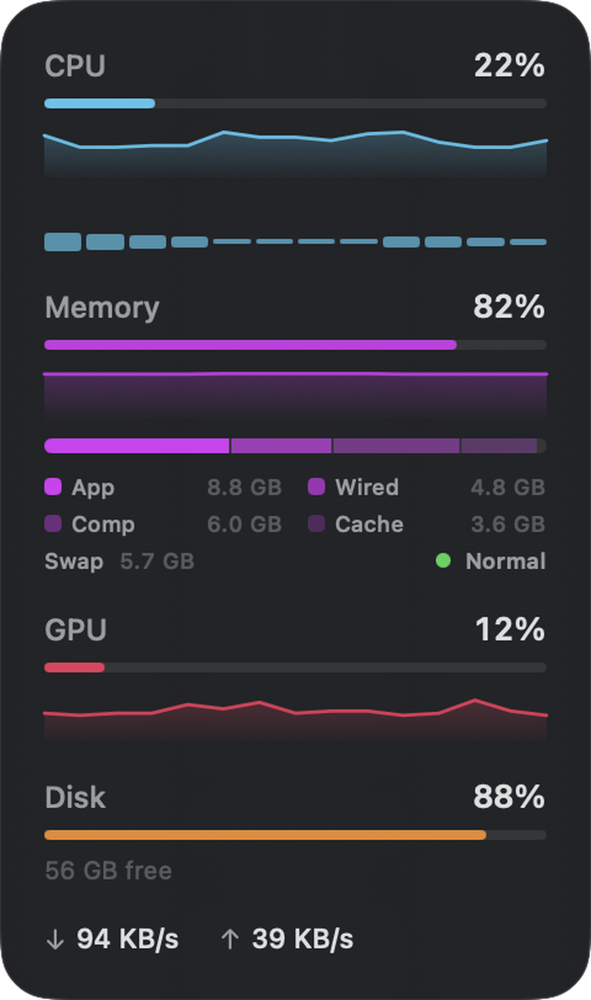

# Mac Resource Widget

A real-time system monitor that lives on your macOS desktop.

<p align="center">
  
</p>

## Why

macOS already has Notification Center widgets — but **WidgetKit widgets cannot
update in real time**. The system throttles their refreshes to minutes apart to
save battery, so a CPU meter built with WidgetKit would show stale numbers.

Mac Resource Widget is a lightweight native window that polls **every 1–5
seconds** for genuinely live data, and sits on your desktop behind your app
windows like a piece of desktop furniture. No Dock icon, no menu-bar clutter.

## Features

- **Live metrics** — CPU (with per-core bars), Memory, GPU, Disk, Network, Battery
- **Sparkline history** — 60-sample rolling graphs for CPU / Memory / GPU
- **Detailed memory** — App / Wired / Compressed / Cached breakdown, plus swap
  usage and memory-pressure indicator
- **Compact mode** — collapse to a single-line pill
- **Battery-aware** — pauses polling when the widget is covered or the display
  sleeps; throttles refresh on battery
- **Stays out of the way** — excluded from Mission Control, Stage Manager and
  ⌘-Tab; sits behind your app windows (or pin it always-on-top), and hides
  while another app is full screen, such as a browser video
- **Customizable** — toggle any metric, pick refresh rate, color theme and
  background opacity
- **No dependencies** — pure Swift + AppKit + SwiftUI

## Requirements

- macOS 14 (Sonoma) or later
- Apple Silicon or Intel (universal binary). GPU utilization is read from the
  `IOAccelerator` registry, tuned for Apple Silicon; Intel GPUs may report
  under a different key
- To build: the Swift toolchain (Xcode or the Command Line Tools)

## Install

### Download (recommended)

1. Open the [**Releases**](../../releases) page and download the latest
   `MacResourceWidget.dmg`.
2. Open the DMG and drag **Mac Resource Widget.app** onto the Applications
   shortcut.
3. Launch it from Applications.
4. To start it automatically, add the app under
   **System Settings → General → Login Items**.

Each release also ships a `MacResourceWidget.dmg.sha256` checksum. To verify
the download is intact, put both files in the same folder and run:

```sh
shasum -a 256 -c MacResourceWidget.dmg.sha256
```

> **First launch:** the app is ad-hoc signed (it has no paid Apple Developer
> ID), so macOS Gatekeeper blocks it the first time. Right-click the app →
> **Open** and confirm — or allow it under **System Settings → Privacy &
> Security**. You only need to do this once. See the [FAQ](#faq) for why.

### Build from source

```sh
git clone https://github.com/FerMPY/mac-resource-widget.git
cd mac-resource-widget
./build.sh                       # compiles and assembles the .app
open "Mac Resource Widget.app"
```

`./package.sh` produces a distributable `MacResourceWidget.dmg`.

## Usage

- **Drag** anywhere on the widget to reposition it (position is remembered).
- **Right-click** for the menu:
  - **Edit Widget…** — toggle metrics, refresh rate, theme, opacity, layout
  - **Open Activity Monitor**
  - **Compact Mode** — single-line layout
  - **Always on Top** — float above all windows instead of sitting behind them
  - **Quit**

## FAQ

### Why isn't this a Notification Center or desktop widget?

The widgets in Notification Center — and the ones you can drag onto the
desktop in macOS Sonoma and later — are all built with Apple's **WidgetKit**.
WidgetKit widgets don't run continuously. Each one hands the system a
*timeline* of pre-rendered snapshots, and **the OS decides when to refresh
them** — usually minutes apart, and throttled hard to protect battery.

That model is perfect for slow-moving data like weather, calendar or
reminders. It is fundamentally wrong for a system monitor: a CPU or network
graph that only updates every 5–15 minutes tells you nothing useful.

So Mac Resource Widget is deliberately **not** a WidgetKit widget. It is a
small standalone app with its own always-running window that polls every 1–5
seconds. The tradeoff: it doesn't appear in the macOS widget gallery, and you
install it like a normal app. The payoff: the numbers are genuinely live.

### Does it drain battery or slow down my Mac?

Very little — it is specifically designed not to. Polling stops completely
whenever the widget is hidden or the display sleeps. See
[Power efficiency](#power-efficiency) for the full breakdown.

### Why does macOS say it can't verify the app?

The app is *ad-hoc signed* — it is not signed with a paid Apple Developer ID
and is not notarized, so Gatekeeper flags it on first launch. Right-click →
**Open** to bypass it once. Building from source yourself avoids the warning
entirely.

## How it works

Pure Swift, no third-party dependencies:

| Metric | Source |
|--------|--------|
| CPU / per-core | Mach `host_processor_info` |
| Memory | Mach `host_statistics64` (`vm_statistics64`) |
| Swap | `sysctl vm.swapusage` |
| GPU | `IOAccelerator` IORegistry (`PerformanceStatistics`) |
| Disk | `statfs` |
| Network | `getifaddrs` interface byte counters |
| Battery | `IOPowerSources` |

The widget is a borderless, normal-level `NSWindow` with the `.stationary`
collection behavior — that combination keeps it clickable while making window
management (Mission Control, Stage Manager, Exposé) treat it like the desktop.

## Power efficiency

A monitor you leave running all day shouldn't itself be a drain. The widget is
built to cost almost nothing when you aren't looking at it:

- **Pauses when hidden.** The instant the widget is fully covered by other
  windows, polling stops entirely — no timers, no CPU wakeups. It resumes the
  moment any part of it is visible again. Since the widget normally sits behind
  your app windows, this is the common case.
- **Pauses when the display sleeps.** When the screen sleeps, polling stops
  until it wakes.
- **Throttles on battery.** On battery power the refresh interval automatically
  slows down (configurable under *Edit Widget → Refresh*).
- **Skips idle redraws.** Metric values are quantized to display precision and
  the snapshot is compared before publishing, so an idle system triggers no
  SwiftUI re-renders at all.
- **Cheap data sources.** Metrics come from lightweight Mach and `sysctl`
  kernel counters — no polling subprocesses spinning in the background.

The net effect: with the widget covered by your apps for most of the day, it
does measurable work only for the seconds it is actually on screen.

## Known limitations

- **Not a WidgetKit / Notification Center widget** — a deliberate tradeoff;
  WidgetKit cannot refresh in real time.
- **Activity Monitor** opens from the right-click menu but the matching tab
  cannot be pre-selected (no API for that), and its cold launch takes a moment.
- **GPU on Intel Macs** may need a different IORegistry key than the Apple
  Silicon path.

See [`docs/ROADMAP.md`](docs/ROADMAP.md) for planned features and ideas.

## License

[MIT](LICENSE)
